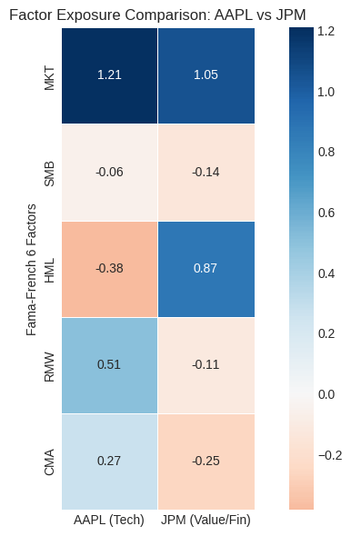
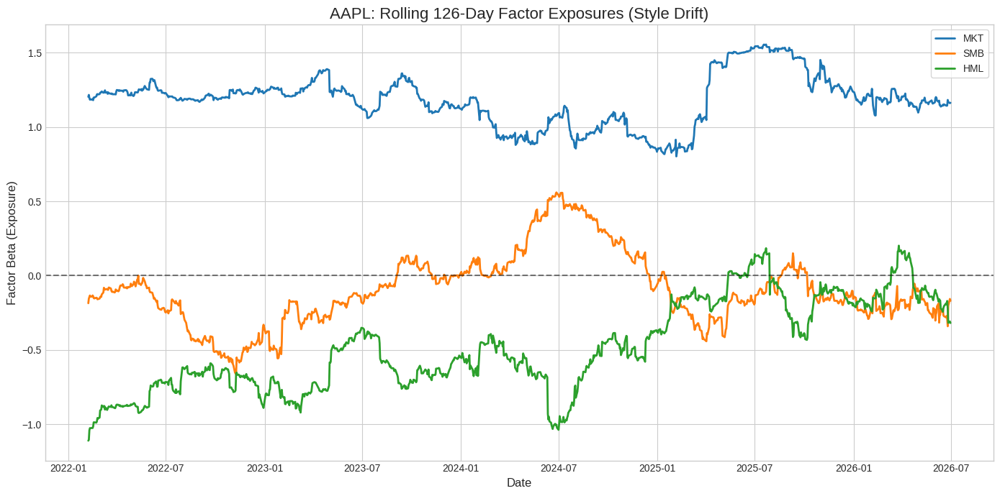
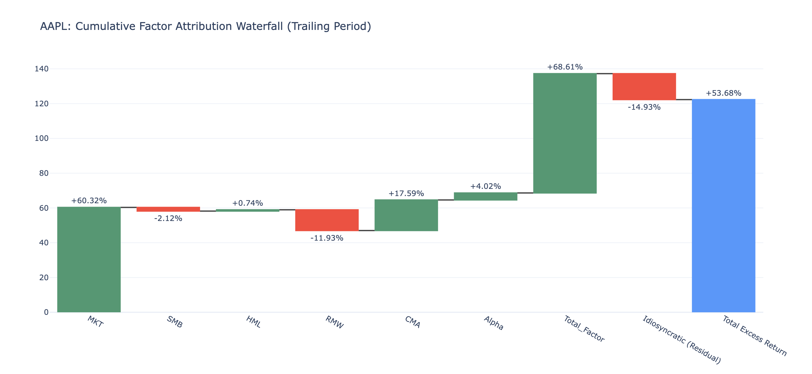

# Multi-Factor Equity Return Attribution Engine 

## Project Overview
This project is an automated quantitative research pipeline that decomposes the historical returns of individual equities into systematic risk factors and idiosyncratic stock-specific performance ($\alpha$). 

Instead of relying on the traditional single-factor Capital Asset Pricing Model (CAPM), this engine implements the **Fama-French 5-Factor Model** (Market, Size, Value, Profitability, and Investment). By utilizing rolling time-series regressions, the engine visualizes "style drift" over time and generates return attribution waterfalls, allowing portfolio managers to clearly separate broad market beta from unique stock-picking alpha.

## Core Features
* **Automated Data Pipeline:** Asynchronously fetches and fully aligns daily adjusted equity prices (via `yfinance`) with daily factor returns (via `pandas_datareader` / Kenneth French Data Library).
* **Robust Time-Series Alignment:** Handles timezone discrepancies, missing data, and trading holiday mismatches using normalized Datetime indices and inner joins.
* **Econometric Modeling:** Implements both static and rolling-window (126-day) Ordinary Least Squares (OLS) regressions using `statsmodels`.
* **Return Attribution:** Calculates the daily mathematical contribution of each risk factor to the total historical excess return.
* **Interactive Visualization:** Uses `plotly` and `seaborn` to generate professional-grade waterfall attribution charts, rolling exposure line graphs, and comparative factor heatmaps.

## The Mathematical Framework
The engine calculates excess returns over the risk-free rate ($R_f$) and fits the following multivariate regression:

$$R_{it} - R_{ft} = \alpha_i + \beta_1(MKT_t) + \beta_2(SMB_t) + \beta_3(HML_t) + \beta_4(RMW_t) + \beta_5(CMA_t) + \epsilon_{it}$$

Where:
* **$\alpha$** = Idiosyncratic premium (unexplained return)
* **$\beta_x$** = Factor exposures
* **$\epsilon$** = Residual risk / noise

## Visual Output Examples

### 1. Factor Exposure Heatmap (Tech vs. Financials)
*AAPL demonstrates strong Growth (negative HML) and Profitability (RMW) exposure, while JPM demonstrates classic Value (positive HML) characteristics.*
 
### 2. Rolling 126-Day Factor Exposures (Style Drift)
*Tracking how the market treats the stock over time. Apple maintains a high, stable market beta but exhibits shifting profitability and growth profiles.*
 

### 3. Cumulative Return Attribution Waterfall
*Decomposing a 5-year total excess return. Proves that the vast majority of positive performance was driven by broader market (MKT) beta rather than stock-specific alpha.*
 

## Technology Stack
* **Languages:** Python
* **Data Manipulation:** `pandas`, `numpy`
* **Statistical Modeling:** `statsmodels`, `scipy`
* **Data Acquisition:** `yfinance`, `pandas_datareader`
* **Visualization:** `plotly`, `matplotlib`, `seaborn`

## How to Run
1. Clone this repository.
2. Install the required dependencies: `pip install yfinance pandas-datareader statsmodels plotly seaborn`
3. Open the `.ipynb` notebook in Jupyter or Google Colab and run all cells sequentially.
